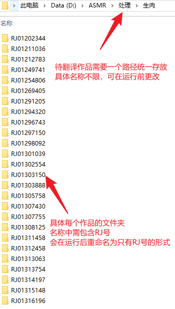
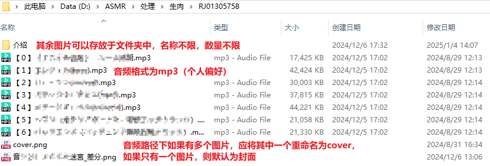
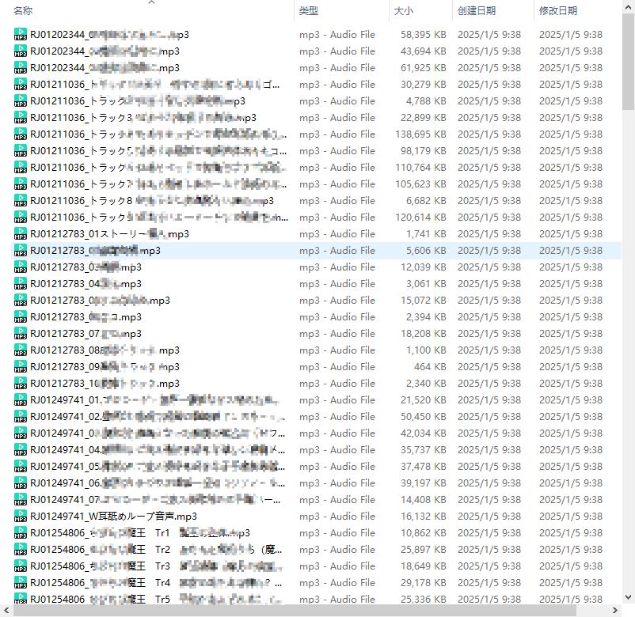
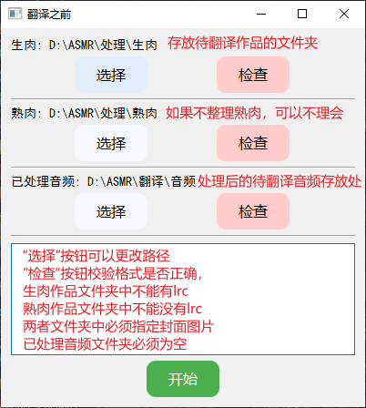
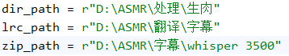

## 日文ASMR辅助机翻工具

​		本项目仅用于机翻的前期辅助工作和后期的整理工作，本身并不能进行机翻，适合能接受机翻的听众或者喜欢收集的仓鼠党

------

### 项目背景

​		作为一个入坑ASMR没多久的新人，我十分喜欢这种作品。在此之前，我从来没有对某件事有如此强烈而持久的兴趣。但可惜的是，我并不会日文，虽然看番多年，但只能听懂一些短语。每次碰到新放流的作品，感觉内容很涩，但又听不懂，就很着急，非常影响我打胶的效率。幸好有大佬分享了一个用3500小时数据集训练的whisper微调模型，真的是及时雨，这个模型的精准度相较于之前另一位大佬分享的500小时数据集的模型有很大提升，并且两者都可以直出中文。虽然在各种语音识别转文字模型和翻译模型中，可能算不上最好，本身也有一些幻听，漏翻的毛病，但对于ASMR作品较为简单的词汇量来说，也算是够用了，不太影响我打胶，看不懂的地方就交给想象力。

​		本项目就是专门用于辅助批量机翻并且进行整理的一些小工具，由于本人能力有限，除了个别功能，其余的目前只能在pycharm中运行，后面会慢慢升级改造。

---

### 功能

#### 0、使用前提

​		本项目的正常运行需要待翻译的生肉满足一定的格式，详情如下图所示。

#### 1、翻译前工具 before_trans

​		因为在这个模型中，存放待翻译音频的文件夹中，只能存放音频，不能存放文件夹。在同时翻译多部作品时，如果只是单纯的将音频粘贴到文件夹中，后续分拣的话就很麻烦。

​		这个工具就是将作品的RJ号作为每个音轨的前缀，翻译完成后，通过另一个”翻译后工具“将lrc文件移动到对应位置，效果如下图所示。

​		这个功能由于非常简单，所以做了图形化界面，但是由于能力有限，还是有些小毛病，在运行期间，窗口会卡死，不用管，这说明运行一切正常，详情如下图所示。

#### 2、翻译后工具 after_trans

​		这部分包括之后就只有后台代码，如果需要更改路径，就需要更改代码，不过位置都很明显，还是比较简单的。

​		这部分主要功能包括将翻译后的lrc文件放入对应的作品文件夹，并且将lrc文件打包存放，所以这里需要准备存放lrc的文件夹和存放lrc压缩包的文件夹，代码中也将这两部分路径和生肉总文件夹路径单独列出来，方便更改

​		除了上述功能外，还有一些整理方面的功能，包括爬取dlsite作品页面（需翻墙，如果还是不行，可开启v2ray的tun模式），将作品信息存放到数据库中，修改音频元信息，包括RJ号，声优和封面，同时修改文件夹的desktop.ini，可在查看->超大图标下浏览，然后用potplayer播放，效果如下图所示。

​		整体效果比foobar2000智享阁版本要差一些，但胜在不卡，音频一多，foobar2000就经常卡退，当然，也可能是我电脑太烂了。除此之外，还可以看完整作品名，文件夹悬停的话，也可以看介绍信息（还没做）。

​		

#### 3、整理 organize_asmr

​		这个功能有两个应用场景，一个是帮你将wav转320kbpsmp3，一个是整理从asmrone上下载的文件，将其格式化为可以使用的格式，但是需要自行从图片中挑一张当封面，并且在本地指定文件夹搜索汉化。

​		目前**不推荐使用**，因为解压软件用的是我本地的，哈哈哈，用python内嵌的总是报错，就用命令行运行本地的，能跑就一直没管，后面再修吧

#### 4、其他

**asmr_db**：这个功能主要是把爬虫操作抽取到类中集中管理，再做了一个更新数据库的函数

**check**：一些检查功能，很久没更新，应该有些不能用了

**deal_long_lrc**：这个模型直出的lrc有些问题，超过一小时之后，就会变成”时分秒毫秒“的格式，但是这合适用不了，需要转化为”分秒毫秒“格式。另外，如果超过100分钟的话，lrc格式就不能用了，vtt好像还能用，或者把音频切成两半，挺麻烦的

**replace_filename**：kaggle对上传文件名有限制，虽然我在before中已经进行了替换，但是还有一些隐藏规则，它不会报错，会让整个上传在最后阶段卡住，目前试下来时文件名过长的原因。但是也不管那么多了，全都替换成数字，运行完再替换回来

